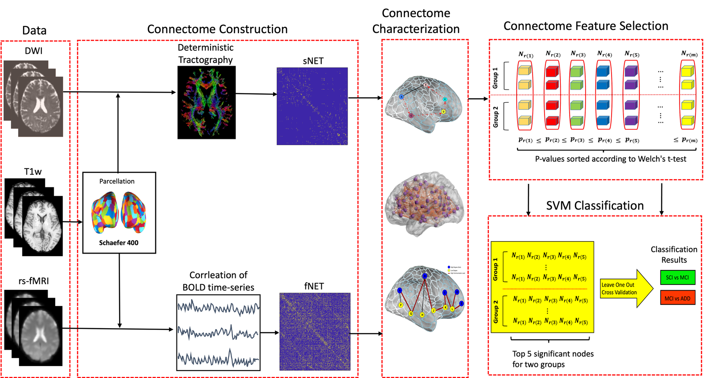
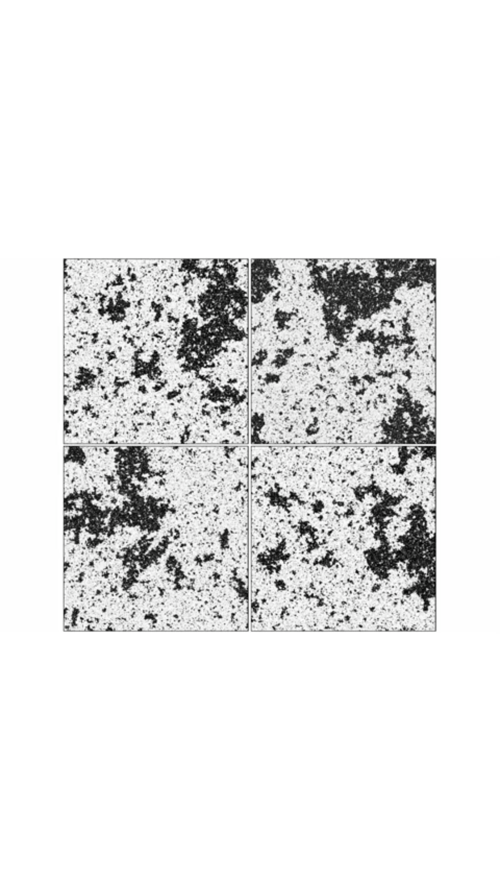

The **critical brain hypothesis** holds that large-scale neural networks self-organise near a continuous phase transition between ordered and chaotic dynamics — a regime that maximises information transmission and dynamic range. This senior design project asks a clinical question on top of that physics: **does Alzheimer's Disease break criticality, and can we measure how far a brain has drifted from it?**

## Approach

- **Data.** Subject-specific structural connectomes from Diffusion Tensor Imaging (DTI) for 88 participants across three groups — Alzheimer's (AD), Mild Cognitive Impairment (MCI), and Subjective Cognitive Impairment (SCI).
- **Model.** We run a Greenberg–Hastings cellular automaton on each subject's connectome and characterise the network's phase space with statistical-physics susceptibility metrics: the peak of the second-largest cluster size and the maximal variance of network activity.
- **Validation.** Simulated functional connectivity matches empirical resting-state fMRI networks *most closely exactly at the structurally-defined critical threshold* — evidence that functional topology emerges from structural criticality.

## A new biomarker: Distance to Criticality

In AD patients the phase transition looks **flattened** — diminished susceptibility peaks, consistent with an extended Griffiths phase. To quantify this, we introduce **Distance to Criticality (DTC)**: how far a subject's optimal operating point sits from their own topological transition. Preliminary classification suggests DTC captures pathological features that standard static correlation metrics miss, particularly in severe disease.

The takeaway: Alzheimer's may drive a systemic shift of the brain's dynamical working point toward a subcritical, disordered phase — and "distance to criticality" is a candidate physics-informed marker of that shift.
