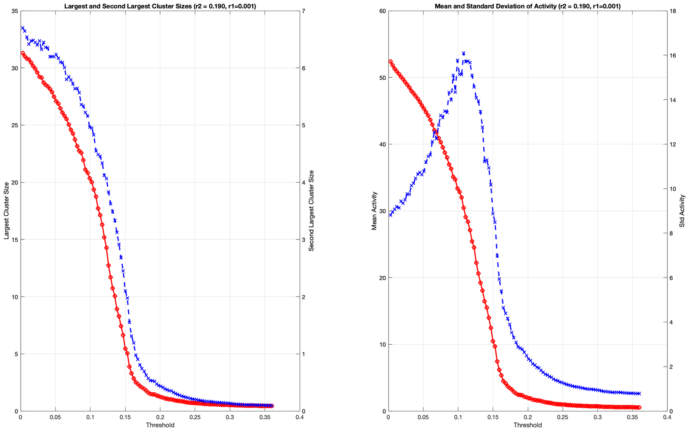
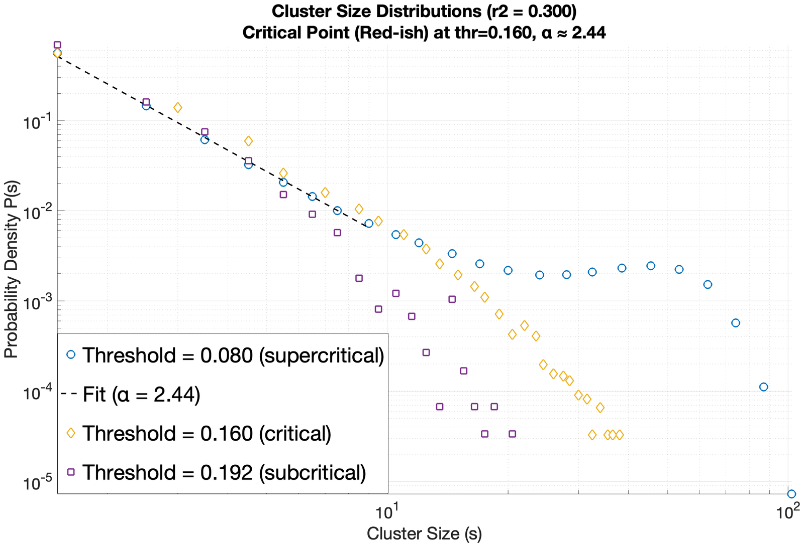
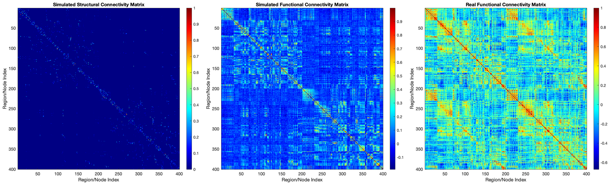
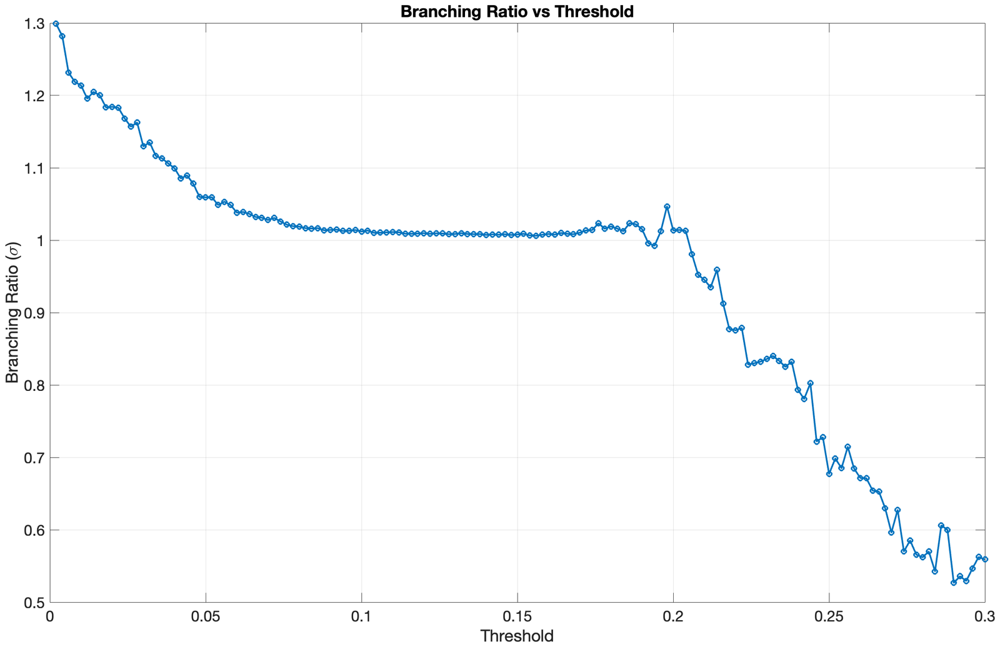
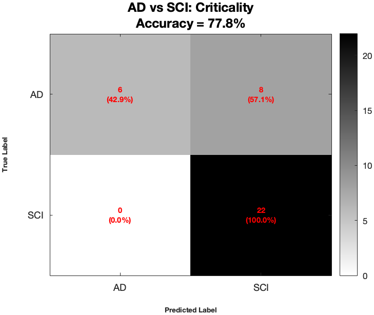

The **critical brain hypothesis** holds that large-scale neural networks self-organise near a continuous phase transition between ordered and chaotic dynamics — a regime that maximises information transmission and dynamic range. This senior design project asks a clinical question on top of that physics: **does Alzheimer's Disease break criticality, and can we measure how far a brain has drifted from it?**

## Approach

- **Data.** Subject-specific structural (DTI) and resting-state functional (fMRI) connectomes for 88 participants across three groups — Alzheimer's (AD, n=14), Mild Cognitive Impairment (MCI, n=43), and Subjective Cognitive Impairment (SCI, n=23) — parcellated into roughly 400 regions of interest.
- **Model.** We run a 3-state Greenberg–Hastings cellular automaton (quiescent → excited → refractory) on each subject's structural connectome and characterise the network's phase space with statistical-physics susceptibility metrics: the peak of the second-largest cluster size and the maximal variance of network activity, alongside a full mean-field fixed-point derivation with Jacobian-based stability analysis to back the simulation.
- **Validation.** Simulated functional connectivity matches empirical resting-state fMRI networks *most closely exactly at the structurally-defined critical threshold* (**Tc ≈ 0.14–0.15**, agreeing across the cluster-size peak, the mutual-information peak, and the fMRI-similarity peak) — evidence that functional topology emerges from structural criticality. At criticality, the cluster-size distribution follows a power law with exponent **α ≈ 2.44**, consistent with genuinely scale-free dynamics rather than an arbitrary threshold effect.
- **Regional specificity.** By resting-state subnetwork, the simulated-vs-real connectivity correlation is highest in the **Somatomotor** subnetwork and the chi-squared distance smallest in **Visual Cortex** — the model-to-brain match isn't uniform across the cortex.

## Locating the transition

Sweeping the activation threshold *T* moves the network across its order–disorder transition, and three independent susceptibility signatures are used to find it. The largest cluster collapses as *T* rises; the **second-largest cluster peaks** at the point where the giant component is breaking up, which is the standard percolation-order-parameter diagnostic; and the **standard deviation of network activity** peaks in the same neighbourhood, since fluctuations are maximal at a continuous transition. Mean activity itself falls monotonically and carries no transition information on its own — it is the variance that localises the critical point.

At the threshold those diagnostics agree on, the distribution of cluster sizes is scale-free over roughly a decade, with a fitted exponent **α ≈ 2.44**. Away from it the distribution is not merely shifted but qualitatively different: the supercritical sweep develops a heavy bump at large cluster sizes (a spanning cluster that never fragments), while the subcritical sweep falls off sharply (activity that dies before it can spread). A power law appearing only at the threshold identified independently by the susceptibility peaks is the evidence that this is a genuine critical point and not an artifact of where the threshold was placed.

## Does the simulated brain look like the real one?

The test that matters is whether dynamics run on a subject's *structural* wiring reproduce that subject's *functional* connectivity — the correlation structure actually measured with resting-state fMRI. Running the automaton on the structural connectome and correlating the resulting regional activity time-series gives a simulated functional network that can be compared directly against the measured one.

The structural matrix is sparse and strongly diagonal-dominant: direct white-matter connections are relatively few and mostly local. The measured functional matrix is dense and block-structured, because regions co-activate without needing a direct anatomical link. The simulated functional matrix recovers that block structure from the sparse structural input — correlations appear between regions with no direct edge between them, which is the point. The match is closest precisely at the critical threshold, and degrades on either side.

## A named phenomenon, not just a peak

The branching ratio σ (average descendants per active node) doesn't show a single sharp critical point across the threshold sweep so much as a **plateau near σ ≈ 1 over an extended range (~0.05–0.18)**. That flattened signature is a **Griffiths phase**, driven by structural heterogeneity in the connectome (following Moretti & Muñoz, 2013) — the brain glides along a broad ridge of near-critical behaviour rather than sitting at one knife-edge threshold.

The distinction matters for interpretation. A conventional critical system has σ = 1 at exactly one threshold, and σ crosses it transversally; here σ stays pinned near unity across a broad interval before dropping away. In the Griffiths picture this happens because a heterogeneous network contains rare, densely connected regions that can sustain activity at thresholds where the bulk of the network cannot, so the transition is smeared over a range rather than occurring at a point. Practically, it means "distance from criticality" has to be defined against an extended near-critical region rather than a single *T*c, which is what the biomarker below has to contend with.

## A new biomarker: Distance to Criticality

In AD patients the phase transition looks **flattened** — diminished, broader susceptibility peaks relative to SCI and MCI, consistent with a further-extended Griffiths phase and a shift toward a subcritical, disordered regime. To quantify this, we introduce **Distance to Criticality (DTC)**: how far a subject's optimal operating point sits from their own topological transition.

Classifying AD vs. SCI with a linear SVM (5-fold cross-validation) on a 17-feature set spanning critical-point location, operating-point fit, DTC, and Griffiths-phase shape, the **criticality-based feature subset reaches 77.8% accuracy** — clearly ahead of feature subsets built from pure goodness-of-fit metrics alone. The confusion matrix shows why that number needs a caveat: all 22 SCI subjects are correctly classified, but only 6 of 14 AD subjects (42.9%) are correctly identified as AD, with the other 8 misclassified as SCI. The false negatives concentrate specifically in **early- and mild-stage AD**, whose dynamical signatures overlap healthy aging — DTC as a biomarker is more of a "clearly diseased" detector than an early-warning one at this sample size.

A separate, unexplained finding: **four AD subjects** sit far below the rest of their cohort on every cluster/activity curve, with severe apparent structural disconnection, yet unremarkable clinical records and standard graph metrics (degree, clustering, betweenness) — the network seems to fragment before it even reaches the critical threshold, for reasons we don't have an explanation for yet.

The asymmetry in that matrix is the honest result. Perfect specificity with 42.9% sensitivity, on a cohort where AD is the minority class, is close to what a classifier gets by leaning toward the majority label — the criticality features are carrying real signal, since they beat the goodness-of-fit subsets, but the operating point is heavily skewed toward ruling disease out rather than detecting it.

The takeaway: Alzheimer's may drive a systemic shift of the brain's dynamical working point toward a subcritical, disordered phase, and "distance to criticality" is a candidate physics-informed marker of that shift — though with a small AD cohort (n=14) and sensitivity concentrated in more advanced disease, it needs validation on a larger, independent dataset before it's more than a promising signal.
