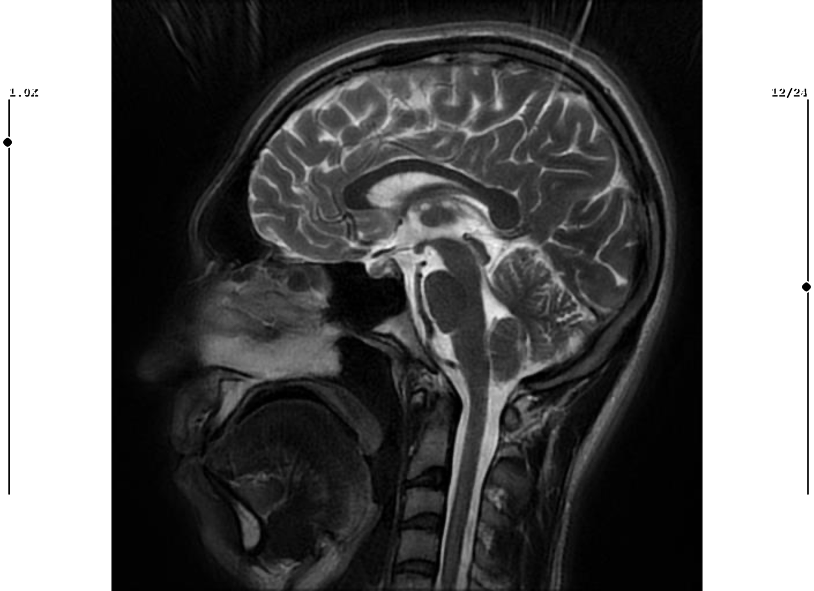
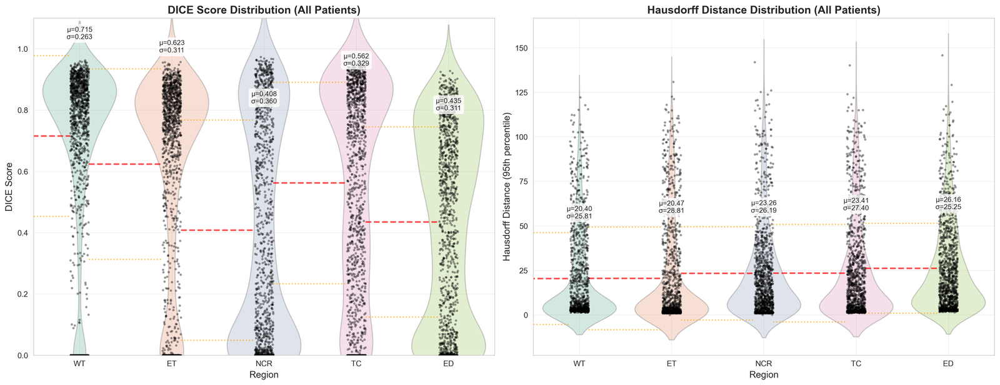

Glioblastoma is the most aggressive class of primary brain tumor, and accurate segmentation of its sub-regions — necrotic core, enhancing tumor, peritumoral edema — is essential for quantifying tumor volume and planning radiotherapy. Modern approaches lean on deep U-Nets, which need large annotated datasets and are hard to interpret. **We asked how far a fully classical pipeline can get with no training data at all.**

## Pipeline

Built on the **BraTS 2021** dataset (multi-modal T1, T1CE, T2, FLAIR scans from 1,251 patients):

- **Preprocessing** — brain-mask extraction, N4 bias-field correction, z-score normalisation, and light Gaussian smoothing to tame intensity inhomogeneity.
- **Hierarchical segmentation** — instead of one classifier, we exploit the biological nesting of glioma layers (necrotic core ⊂ enhancing tumor ⊂ whole tumor) and iteratively restrict the domain: whole tumor → tumor core → necrotic core.
- **Geometry as a prior** — morphological operations and convex-hull seed constraints encode the tumor's shape explicitly, rather than learning it.

## Results

Across all patients the pipeline reaches a mean Dice of ≈0.72 on the whole tumor with no learned parameters — respectable for a purely classical method, and fully interpretable at every stage.

The point isn't to beat deep learning — it's to show how much structure you can recover from geometry and physics-based contrast alone, with a method a clinician can actually inspect.
