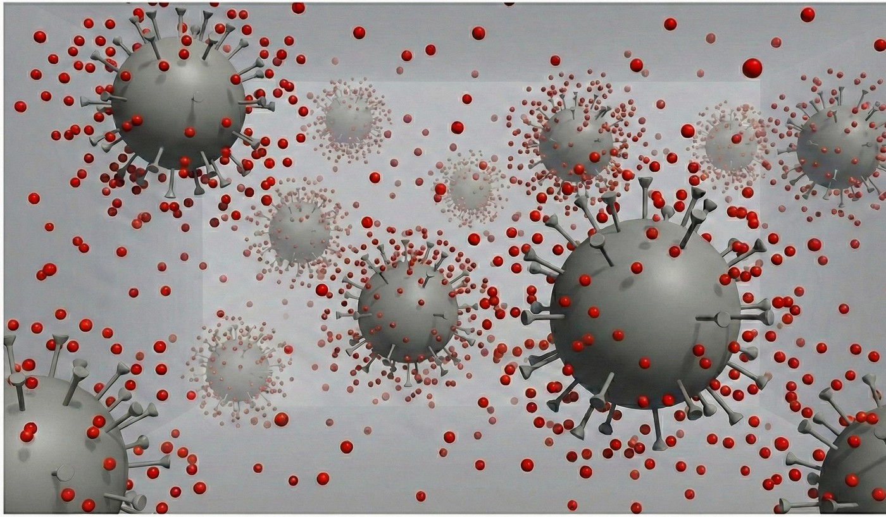
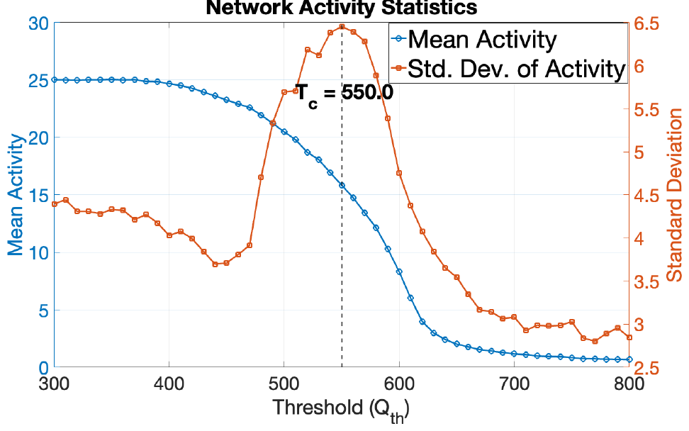
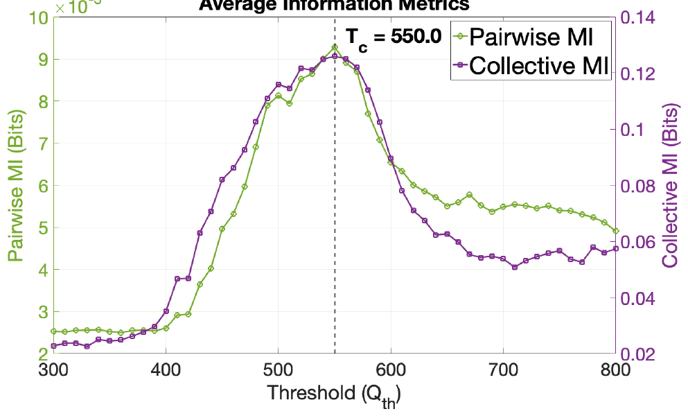
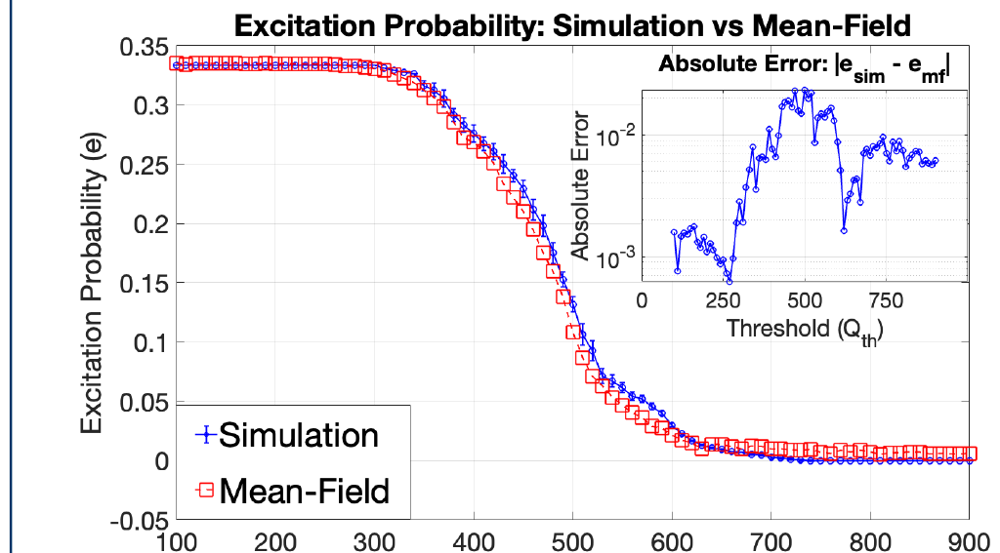
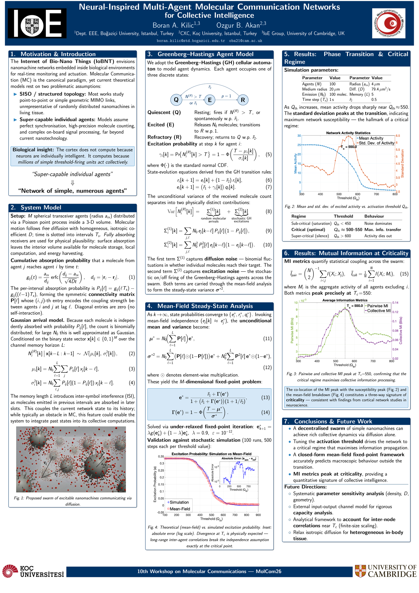

Most work on molecular communication assumes *super-capable* individual nanomachines: perfect synchronisation, precise molecule counting, on-board signal processing far beyond anything current nanotechnology can build. This project asks the opposite question — **what if the agents are almost trivially simple, but there are many of them?**

The inspiration is the cortex. The brain does not compute because individual neurons are clever; it computes because millions of simple threshold-firing units interact collectively. We import that principle into the **Internet of Bio-Nano Things**: a decentralised network of spherical nanomachines that exchange information molecules through free diffusion, each firing according to a local threshold rule.

## What we did

- **Model.** Each agent is a Greenberg–Hastings excitable cellular automaton with three states — quiescent, excited, refractory. An agent fires when the molecules it absorbs in an interval exceed an activation threshold *T*, releasing *N₀* molecules that diffuse to its neighbours as fully-absorbing receivers. Simulated: N = 100 agents Poisson-distributed in a sphere of radius 20 µm, receiver radius 4 µm, diffusion coefficient D = 79.4 µm²/s, 100 molecules per emission, a channel memory of 5 time steps, and a 1 s time slot.
- **Theory.** From the diffusion channel's analytically-derived absorption probability and the firing rule, we derive closed-form, mean-field fixed-point equations for the steady-state population of excited agents (solved via under-relaxed fixed-point iteration), and validate them against stochastic simulation.
- **Result.** The network undergoes a **second-order phase transition at a critical activation threshold Tc = 550.0** molecules, separating a sub-critical "saturation" phase (threshold below ≈450, noise-dominated) from a super-critical "silence" phase (threshold above ≈600, activity dies out). Mean population activity falls from about 25 of 100 agents active in the sub-critical phase to near zero above the transition, while the standard deviation of activity — the susceptibility — peaks sharply right at Tc. Both pairwise and collective **mutual information peak at that same threshold** — the system maximises information propagation and processing capacity at the "edge of chaos."

## Locating the transition

Sweeping the activation threshold moves the swarm through three qualitatively different regimes. Below roughly 450 molecules the network saturates — agents fire on ambient arrivals and activity is noise-dominated. Above roughly 600 it falls silent, because no agent accumulates enough molecules to reach threshold before its neighbours have gone refractory. In between, near **Tc = 550**, activity is sustained but not saturated.

Mean activity alone does not identify that point: it decreases monotonically across the whole sweep. What locates the transition is the **standard deviation**, which peaks sharply at Tc. That peak is the network's susceptibility — the regime where a small change in threshold produces the largest change in collective behaviour, and where the swarm is most responsive to perturbation.

## Information peaks where susceptibility does

Susceptibility says the network is maximally responsive at Tc; it does not by itself say the network is computing anything. The information-theoretic measures are what close that gap. Both **pairwise mutual information** (averaged over agent pairs) and **collective mutual information** (each agent against the aggregate activity of all others) peak at the same threshold the susceptibility peak identified.

The two measures peaking together matters. Pairwise MI could rise simply because two agents share a common driver; collective MI rising with it indicates the swarm as a whole is carrying more information about each of its parts. Their co-location with the susceptibility peak is what turns "the network is twitchy here" into "the network processes the most information here."

## Where the theory breaks, and why that is the point

The mean-field prediction matches simulation everywhere *except* near the transition — precisely where long-range correlations develop and the independence assumption breaks down. That gap is not a failure of the theory; it is the signature of criticality: the absolute error between theoretical and simulated excitation probability diverges specifically and only in the neighbourhood of Tc.

The mean-field derivation assumes each agent's state is independent of its neighbours', which is what makes a closed-form fixed point possible at all. Away from the transition that assumption is sound and the curves lie on top of each other. Approaching Tc, agents become correlated over long ranges — exactly the condition under which the independence assumption fails — and the error inset rises by roughly an order of magnitude in that window before falling away again. A theory that failed everywhere would be wrong; one that fails only where correlations are known to diverge is reporting a physical fact about the system.

## Why it matters

A single tunable parameter — the activation threshold — drives the whole network into a critical regime where collective computation emerges from diffusion alone. No complex individual agent required. It gives a quantitative, information-theoretic signature of "collective intelligence" that a real bio-nano network could, in principle, be engineered to sit on.

**Open ends.** The diffusive channel carries significant memory (inter-symbol interference), so even identical initial configurations can diverge dynamically — links are stochastic, not fixed weights as in a static graph network. Channel noise itself is not purely a nuisance: via stochastic resonance it can enhance weak-signal detection rather than degrade it. Natural next steps we haven't done yet: a finite-size-scaling treatment of the correlations that build up near Tc, extending the model to heterogeneous (non-isotropic) tissue diffusion, and defining a formal information-theoretic channel capacity for the network rather than relying on mutual information as a proxy.
