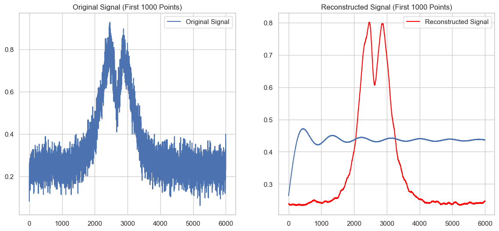
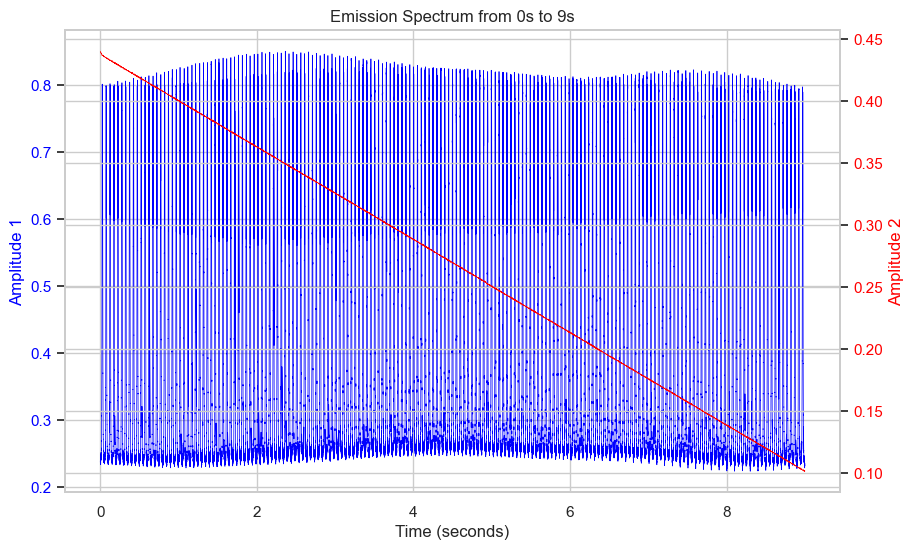

Nitrogen-vacancy (NV) centers are atomic defects in diamond whose fluorescence depends on the local magnetic field, which makes a diamond a remarkably sensitive, room-temperature magnetometer. This is a hands-on experimental project: build the optical and microwave setup, and characterise how well it can actually measure a field.

## What the experiments cover

- **ODMR spectroscopy.** Sweeping a microwave tone across the ≈2.87 GHz NV resonance while collecting photoluminescence gives the optically detected magnetic resonance (ODMR) spectrum. Under a strong bias field we resolve the full **hyperfine structure** — the sets of triplet peaks from the *m*I = −1, 0, +1 nitrogen spin states, split across the four crystallographic NV orientations in the lattice.
- **Lock-in detection.** Frequency-modulating the microwave and demodulating the photodiode signal with a lock-in amplifier converts the ODMR dip into a voltage that tracks the field linearly.
- **Signal recovery.** Raw ODMR sweeps are noisy; I compared moving-average, envelope, exponential and quadrature filtering, with a Hilbert-like envelope method recovering the cleanest peak structure.

## Characterising the instrument

- **Dynamic range.** Sweeping a controlled Helmholtz-coil field (monitored with a fluxgate reference) maps the linear regime of the response curve and where it saturates — the setup measures cleanly out to a few tens of microtesla before nonlinearity sets in.
- **Sensitivity.** Taking the Fourier spectrum of the lock-in output under varied time constants and laser powers quantifies the noise floor and how filter bandwidth trades against sensitivity.

Alongside the measurements I built a Python pipeline for preprocessing the raw detector data and a machine-learning experiment for extracting field estimates from the ODMR spectra.
