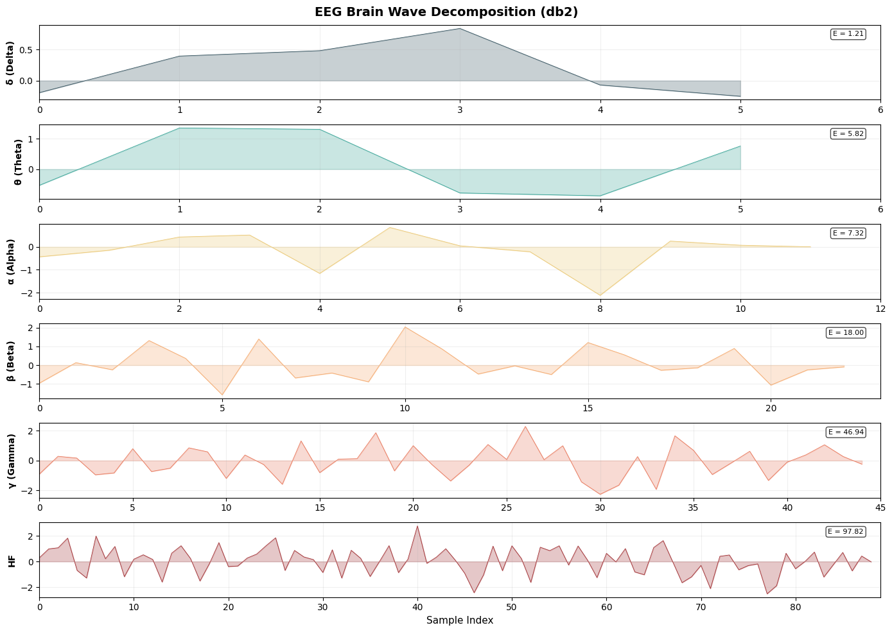
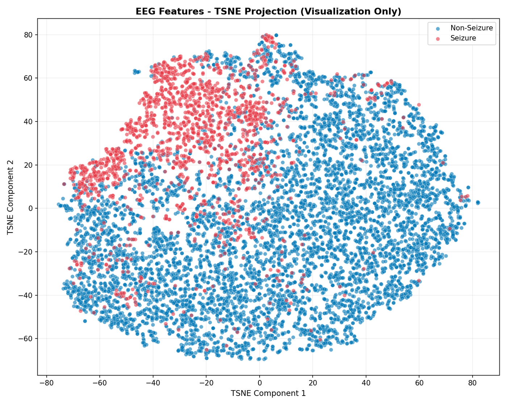

EEG is non-stationary: the frequency content of a seizure changes moment to moment, so a plain Fourier transform — which trades away all time information for frequency — is the wrong tool. The **wavelet transform** keeps both, and that is the core of this project: use it to pull an EEG recording apart into physiologically meaningful rhythms and detect seizures from how energy redistributes across them. Data is the **UCI "Epileptic Seizure Recognition" dataset**: 500 subjects, each split into 23 non-overlapping 178-sample windows (≈1.03 s at 173.61 Hz), for **11,500 samples** total, collapsed to a realistically imbalanced binary problem — 20% seizure, 80% non-seizure.

## Method

- **Denoising** — VisuShrink soft-thresholding on the wavelet coefficients, with the noise level estimated robustly via the median absolute deviation of the finest detail coefficients. Hard thresholding was tried and rejected — it over-smoothed and lost signal content.
- **Band decomposition** — a 5-level discrete wavelet transform maps DWT levels onto the classical EEG bands (using db4 as the mapping example): cD1 (43.4–86.8 Hz) → high-frequency/noise, cD2 (21.7–43.4 Hz) → gamma, cD3 (10.8–21.7 Hz) → beta, cD4 (5.4–10.8 Hz) → alpha, cD5 (2.7–5.4 Hz) → theta, cA5 (0–2.7 Hz) → delta.
- **Features & classification** — three statistics per sub-band (normalized energy, Shannon entropy, standard deviation) give an 18-dimensional feature vector per epoch, classified with SVM, Random Forest, and XGBoost under stratified 5-fold cross-validation.

## Results

The best model — **db2 wavelet + XGBoost** — reaches **96.2% accuracy, 90.2% F1-score, and 98.7% ROC-AUC** (5-fold CV mean). Broken down by class: **98.70% specificity** on non-seizure epochs against **86.74% recall** on seizure epochs, so most of the residual error is seizures the model misses rather than false alarms.

**Why wavelets and not Fourier:** the same 6-band features extracted via FFT instead of DWT — same band definitions, no time localization — get only **51.52% seizure-detection accuracy**, barely better than chance, while still reporting 97.72% non-seizure specificity. In other words, the Fourier-based model essentially always predicts "non-seizure." That gap is the concrete version of the non-stationarity argument the whole project is built on.

**Why db2 specifically:** short filters (db2, sym2) consistently beat longer ones (db8, db16), and Haar performs worst among length-2 wavelets. The reason is decomposition depth: for filter length *L* and signal length *N* = 178, the achievable DWT depth is *J*max = ⌊log₂(*N*/(*L*−1))⌋ — db2 (*L*=4) allows 5 levels, resolving delta and theta separately, while db8 (*L*=16) allows only 3, merging delta, theta, and alpha into one band and losing resolution exactly where ictal discharges are most diagnostic. Feature-importance rankings (PCA loadings) are fairly uniform across sub-bands (0.0555–0.0665) — no single band dominates.

## What separates seizures

Projecting the 18-dimensional feature vectors down to two dimensions with t-SNE shows the seizure and non-seizure populations occupying distinct, well-separated clusters — PCA on the same features captures only ~58% of variance in 2D and shows much more overlap, consistent with the class boundary being non-linear (and with why XGBoost outperforms a linear classifier here).

The project doubles as a from-scratch derivation of the wavelet machinery — multiresolution analysis, the quadrature-mirror filter bank, the fast wavelet transform — grounding the detector in why the transform works, not just that it does. All reported metrics are cross-validation results on this single dataset; there's no test of generalization to an independent EEG cohort.
